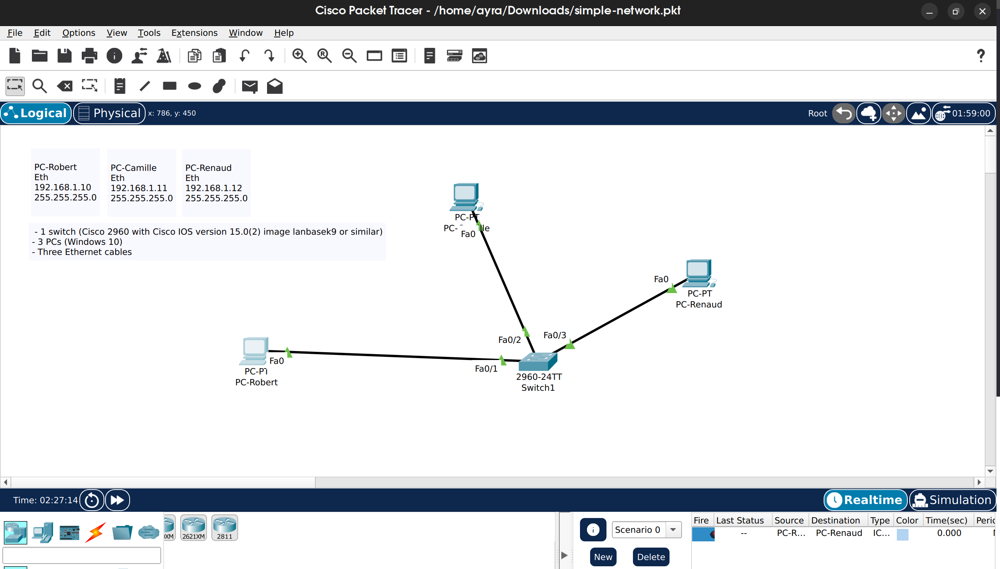

# Build a simple network


**Addressing table :**

| Devices | LAN | IP | Mask |
|---------|-----|----|------|
| PC-Robert | Eth | 192.168.1.10 | 255.255.255.0 | 
| PC-Camille | Eth | 192.168.1.11 | 255.255.255.0 |
| PC-Renaud | Eth | 192.168.1.12 | 255.255.255.0 |

**Resource Requirements :**
- 1 switch (Cisco 2960 with Cisco IOS version 15.0(2) image lanbasek9 or similar)
- 3 PCs (Windows 10)
- Three Ethernet cables

**Goals :**
* to be able to create a simple network
* to be able to configure interconnectivity between hosts
* to be able to connect hosts to the internet


## Write-up

1) Look at the IOS version and check if it match 15.0(2)  image lanbasek9
```bashhow version 
 show version
```

2) Connect PCs (End devices) to the switch (network devices) with Copper Straight-Trough.

3) Assign IP for each computer as mentioned.
- Open PC tab
- Go to IP configuration
- E.g. for Robert, add 192.168.1.10 for his IPv4 Address
- Subnet mask related to Robert IP will appear
- Repeat for Camille, Renaud and close tabs
<p align="center">
  
</p>

4) Configure interconnectivity between hosts
 	> Ping PCs to proove the interconnectivity between them.
  > If it's your first ping, it can take fews minutes to respond.
<p align="center">
  
</p>

5) Connect hosts to the internet
  > Use the browser to visit wwww.osi.local
<p align="center">
  
</p>
  > It shows unusable host, that's because our network miss network devices to get access to internet.
 <p align="center">
  
 </p>
  > We create a router who'll be linked to our swtich.
<p align="center">
  
 </p>


